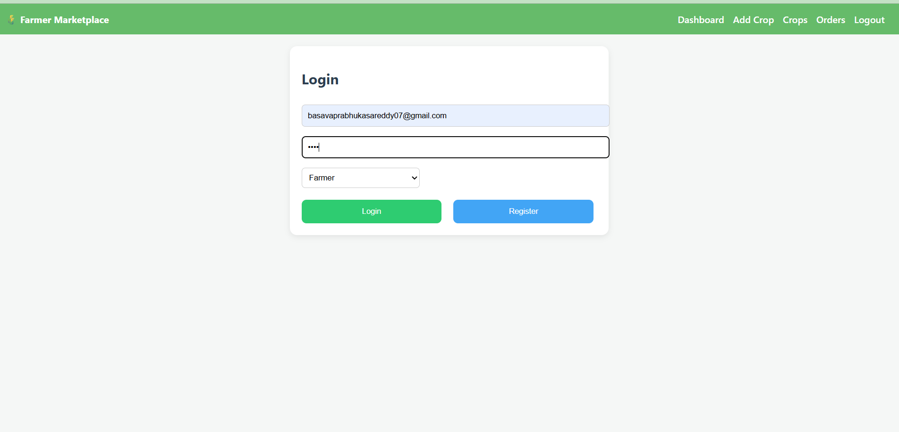
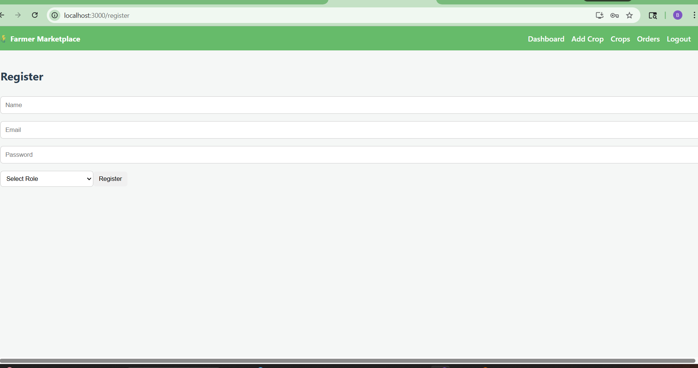

# 🌾 FarmConnect – Farmer Buyer Marketplace

A full-stack web application that connects farmers and buyers directly.

## 🚀 Features

### 👨‍🌾 Farmer
- Register & Login
- Add crops with images
- View orders from buyers
- Accept / Reject / Counter offers

### 🧑‍💼 Buyer
- Register & Login
- View available crops
- Place orders
- Negotiate price
- Accept / Reject counter offers

---


---

## 📸 Screenshots

### 🔐 Login Page


### 📝 Register Page


### 🌾 Add Crop


### 🤝 Orders & Negotiation


### 📊 Order Status


## ✨ UI Highlights (From Screens)

- Clean dashboard navigation
- Card-based crop display
- Status badges (Accepted / Rejected / Countered)
- Inline negotiation system
- Responsive layout

## 🛠️ Tech Stack

### Backend
- Spring Boot
- MySQL
- REST APIs

### Frontend
- React JS
- Axios
- CSS

---

## 📂 Project Structure

```
backend/ → Spring Boot API  
frontend/ → React Application  
uploads/ → Stored crop images  
```

---

## ⚙️ Setup Instructions

### 1️⃣ Clone Repository
```
git clone https://github.com/your-username/farmconnect.git
cd farmconnect
```

---

### 2️⃣ Backend Setup
```
cd backend
```

- Configure MySQL in `application.properties`
- Run:

```
mvn spring-boot:run
```

---

### 3️⃣ Frontend Setup
```
cd frontend
npm install
npm start
```

---

## 🔗 API Base URL

```
http://localhost:8080/api
```

---


---

## 🎯 Workflow

1. Farmer adds crop  
2. Crop visible to Buyer  
3. Buyer places order  
4. Farmer accepts/rejects/counters  
5. Buyer responds  
---

## 👨‍💻 Author

Basavaprabhu Reddy

